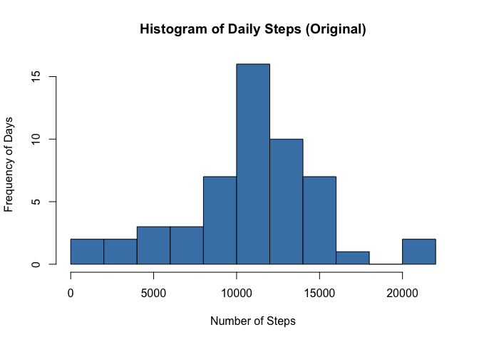
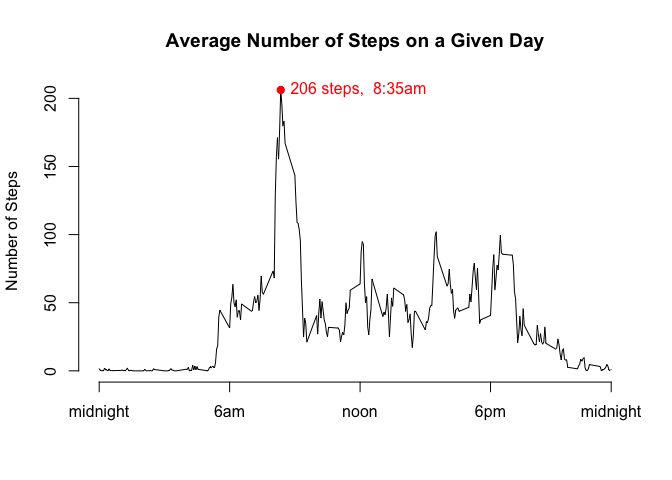
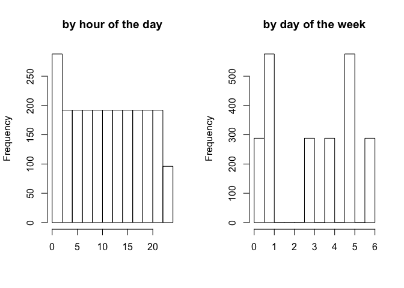
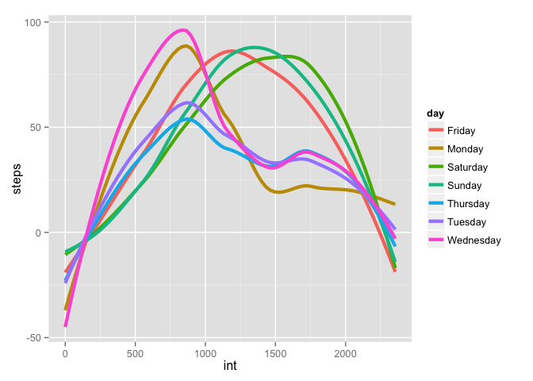
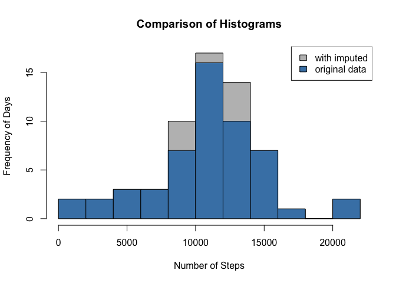
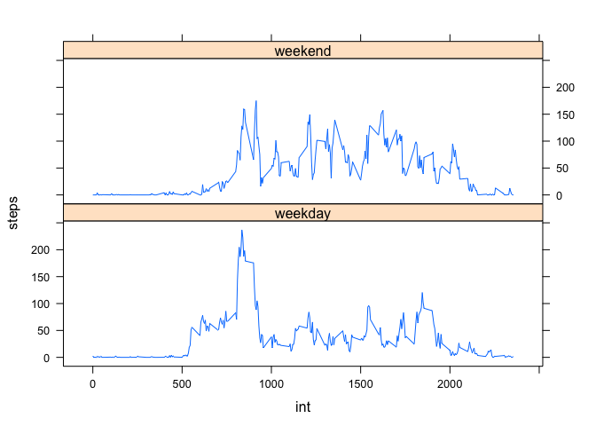
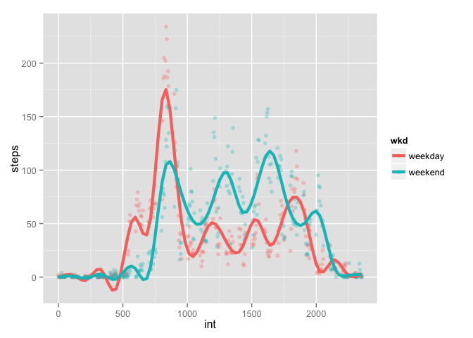

# Reproducible Research: Peer Assessment 1

```r
library(knitr); library(ggplot2); library(car); library(lattice)
opts_chunk$set(echo=TRUE)       ## set global parameter for echo
options(scipen = 1, digits = 2) ## set rounding defaults
```

## Loading and preprocessing the data

We begin by reading-in the data and processing the variables easy manipulation: 


```r
  ## set the working directory
  setwd("~/datasciencecoursera/RepData_PeerAssessment1/")

  ## read the full file
  file    = unz("activity.zip","activity.csv")
  classes = c("numeric","Date","numeric")
  full    = read.csv(file, colClasses = classes)

  ## consolidate date and time into a single variable
  full$int = as.numeric(full$interval)
  full$dt  = paste(full$date,sprintf("%04d", as.integer(full$interval)))
  full$dt  = as.POSIXlt(full$dt,format="%Y-%m-%d %H%M")
  ftime = function(vec){
    vec = as.integer(vec)
    sprintf("%02d:%02d", vec%/%100, vec%%100)
  }
  full = full[,-3]

  ## add modular variables for easier access
  full$day  = as.factor(weekdays(full$dt))
  full$hour = full$dt[[3]]
  full$wkd  = full$day %in% c("Saturday","Sunday") # as logical
  full$wkd  = recode(full$wkd, "TRUE='weekend';else='weekday'", 
                      as.factor.result=TRUE)       # as factor

  ## subset data to complete cases (exclude NAs)
  d      = na.omit(full)
```

## What is mean total number of steps taken per day?

A visual presentation of the daily steps can be given by

```r
  dailysteps  = tapply(d$steps,d$date,sum)
  h1 = hist(dailysteps, breaks = 15, plot=FALSE)
  plot(h1, main = "Histogram of Daily Steps (Original)", col="steelblue",
       xlab = "Number of Steps", ylab = "Frequency of Days")
```

 

```r
  (meansteps   = mean(dailysteps))
```

```
## [1] 10766
```

```r
  (medsteps    = median(dailysteps))
```

```
## [1] 10765
```

The median number of steps is 10766 and the median is 10765.

## What is the average daily activity pattern?


```r
  ## make summary data frame
  avgpat = aggregate(d$steps,list(d$int),mean)

  ## plot daily activity
  plot(avgpat, type="l", ylab="Number of Steps", xlab="",
       main="Average Number of Steps on a Given Day", axes = FALSE)
  axis(side = 1, at = c(0,600,1200,1800,2355),
       labels = c("midnight","6am","noon","6pm","midnight"))
  axis(side = 2)

  ## identify and plot the highest point
  maxint = which.max(avgpat[[2]])
  x = avgpat[[1]][maxint]
  y = avgpat[[2]][maxint]
  maxtime = format(strptime(sprintf("%04d",x),"%H%M"),"%l:%M%p")
  points(x,y,col="red",pch=19)
  maxlab = paste(round(y,0),"steps,",maxtime)
  text(x,y,labels = maxlab, pos=4, col="red")
```

 

Average activity peaks at  8:35am with 206 steps.


## Imputing missing values

>1. Calculate and report the total number of missing values in the dataset (i.e. the total number of rows with NAs)

There are a number of methods to calculate the number of missing values. Two approaches are listed below and checked against one another.


```r
  m1 = sum(is.na(full))       # method 1
  (m2 = nrow(full) - nrow(d)) # method 2
```

```
## [1] 2304
```

```r
  identical(m1, m2)           # check that both produce the same result
```

```
## [1] TRUE
```
There are a total of 2304 incomplete observations.

>2. Devise a strategy for filling in all of the missing values in the dataset. The strategy does not need to be sophisticated. For example, you could use the mean/median for that day, or the mean for that 5-minute interval, etc.

Before we attempt to impute data, we should explore the missing data to try to identify patterns. We begin by exploring histograms of the missing data by hour and day or the week:


```r
missing = full[is.na(full),]
par(mfrow=c(1,2))
hist(missing$dt[[3]], main= "by hour of the day", xlab = "")
hist(missing$dt[[7]], main = "by day of the week", xlab = "",)
```

 

The first histogram suggest that missingness does not seems to follow hourly patterns (since these fairly uniformly distributed). The second histogram does not seem to follow any common distribution, nor does it seem to cluster in any sort of definitive way.

Looking at the histogram of missing data by date, however, we can see that missing data falls on specifics dates:


```r
par(mfrow=c(1,1))
hist(missing$dt,breaks = "day",main = "by date", xlab = "date")
```

 

This suggests that them missing data for 5-min intervals is not missing completely at random-- it clusters around specific dates. These are presumably days when the measurement device was off. We can confirm this more accurately by looking at frequency of missing observations by date:


```r
(misslist = as.data.frame(table(missing$date)))
```

```
##         Var1 Freq
## 1 2012-10-01  288
## 2 2012-10-08  288
## 3 2012-11-01  288
## 4 2012-11-04  288
## 5 2012-11-09  288
## 6 2012-11-10  288
## 7 2012-11-14  288
## 8 2012-11-30  288
```

The printout shows that-- as suspected through visual inspection-- missing data only exists on a full-day basis (as there are 288 5-min intervals in a 24 hour period). Data is missing for 8 different dates.

Consequently, it makes sense to impute data on the basis of daily activity patterns. However, it may be the case that not all days of the week follow the same pattern. To explore whether this might be the case, we plot the average daily pattern for each day of the week:


```r
byday  = aggregate(steps~int+day, data = full, mean, na.rm=TRUE)

# plot by day
bd = ggplot(byday, aes(x=int,y=steps,colour=day))
bd + geom_smooth(aes(group=day),se=FALSE,size=1.5,method="loess")
```

 

The plot suggests that Fridays, Saturdays, and Sundays follow a similar pattern, while other days of the week share simlar trajectories. This fits expectations, as we would anticipate a person to be up an about later in the day on weekend nights (incl Fridays).

The implication for imputation is that the day of the week makes a difference and should be taken into account if we wish to impute more accurate figures. Accordingly, I will chose to impute missing data by swapping-in the average steps for that given day of the week:


```r
for(i in 1:nrow(missing)){
  missing[i,"steps"] = byday[byday$int == missing[i,"int"] & 
                       byday$day == missing[i,"day"],"steps"]
}
head(missing)
```

```
##   steps       date int                  dt    day hour     wkd
## 1   1.4 2012-10-01   0 2012-10-01 00:00:00 Monday    0 weekday
## 2   0.0 2012-10-01   5 2012-10-01 00:05:00 Monday    0 weekday
## 3   0.0 2012-10-01  10 2012-10-01 00:10:00 Monday    0 weekday
## 4   0.0 2012-10-01  15 2012-10-01 00:15:00 Monday    0 weekday
## 5   0.0 2012-10-01  20 2012-10-01 00:20:00 Monday    0 weekday
## 6   5.0 2012-10-01  25 2012-10-01 00:25:00 Monday    0 weekday
```
>3. Create a new dataset that is equal to the original dataset but with the missing data filled in.

We simply merge the two data frame and re-sort them:


```r
fullplus = rbind(d,missing)
fullplus = fullplus[order(fullplus$dt),]
sum(is.na(fullplus))      ## check that there are zero missing values
```

```
## [1] 0
```

>4. Make a histogram of the total number of steps taken each day and Calculate and report the mean and median total number of steps taken per day. Do these values differ from the estimates from the first part of the assignment? What is the impact of imputing missing data on the estimates of the total daily number of steps?

We compare each dataset with a simple analysis of their means and medians.


```r
  dailysteps2  = tapply(fullplus$steps, fullplus$date,sum)
  meanval    = rbind(meansteps,mean(dailysteps2))
  medianval  = rbind(medsteps,median(dailysteps2))
  meancomparsion = data.frame(meanval,medianval)
  row.names(meancomparsion) = c("original data","with imputed")
  meancomparsion
```

```
##               meanval medianval
## original data   10766     10765
## with imputed    10821     11015
```

We observe that the means and medians are very similar between the datasets. Had we imputed on the basis of averages regardless of day of the week, the mean would even have been the same. On the face of it, it looks like not much has changed.

However, if we plot a histogram of each data set and superimpose them on each other, we observe the following:


```r
  ## create histogram object with imputed data set
  h2 = hist(dailysteps2, breaks = 15, plot=FALSE)
  
  ## plot both histograms superimposed over one another
  plot(h2, col="grey", main = "Comparison of Histograms",
       xlab = "Number of Steps", ylab = "Frequency of Days")
  plot(h1, col="steelblue", add=T)
  legend("topright", c("with imputed", "original data"), fill=c("grey","steelblue"))
```

 

The visualization shows that the imputed values add mass to the centre of the distribution and reduce variance. This makes logical sense, as we replaced missing values with average values-- i.e. values that represent central tendancy by definition. We can prove that the variance is brought down through imputation:


```r
var(d$steps); var(fullplus$steps)
```

```
## [1] 12543
```

```
## [1] 11321
```

The consequence is that any subsequent statistical test on the data with imputations will have lower variance. Although the imputation can allow us to run procedure that might otherwise not be possible, the output may bias hypothesis tests and other statistical procedures.

## Are there differences in activity patterns between weekdays and weekends?

>1. Create a new factor variable in the dataset with two levels -- "weekday" and "weekend" indicating whether a given date is a weekday or weekend day.

This factor variable was made in the preprossessing stage.


```r
  table(fullplus$wkd)
```

```
## 
## weekday weekend 
##   12960    4608
```


>2. Make a panel plot containing a time series plot (i.e. type = "l") of the 5-minute interval (x-axis) and the average number of steps taken, averaged across all weekday days or weekend days (y-axis).


```r
bywkd  = aggregate(steps~int+wkd, fullplus, mean)
xyplot(steps~int|wkd, type="l", data=bywkd, layout=c(1,2))
```

 


```r
bywkd  = aggregate(steps~int+wkd, data=full, mean, na.rm=TRUE)
bywkd$lab = formatC(bywkd$int, width = 4, format = "d", flag = "0")


## plot by weekend/weekday
library(splines)
bwd = ggplot(bywkd, aes(x=int,y=steps,colour=wkd))
bwd = bwd + geom_point(aes(group=wkd),alpha=0.3)
bwd +stat_smooth(aes(group=wkd),se=F,size=1.5,
                 method="lm",formula =y~ns(x,20))
```

 
